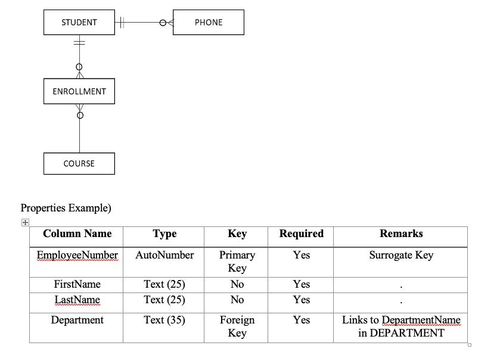

# MISM 3136 /CPSC 3131 Database Design Lab Assignment #1

### Task 1 – Specifying Column Properties:

The following is a set of student-related tables for a university academic information system. These are normalized in 3NF and about to being implemented by using SQLite. However, since this is a conceptual model, we need column properties to implement the model. You task is to provide the column specification as shown in the example.

### Task 2 – Installation of software & Creation of SQLite file
In this task, we will install a software to use SQLite, DB Browser for SQLite. We may install SQLite and use SQLite to manipulate the database, but since it provides only command line interface and we have to learn commands to use the command line interface, we will use DB Browser for SQLite to use the GUI provided by DB Brower for SQLite. 

