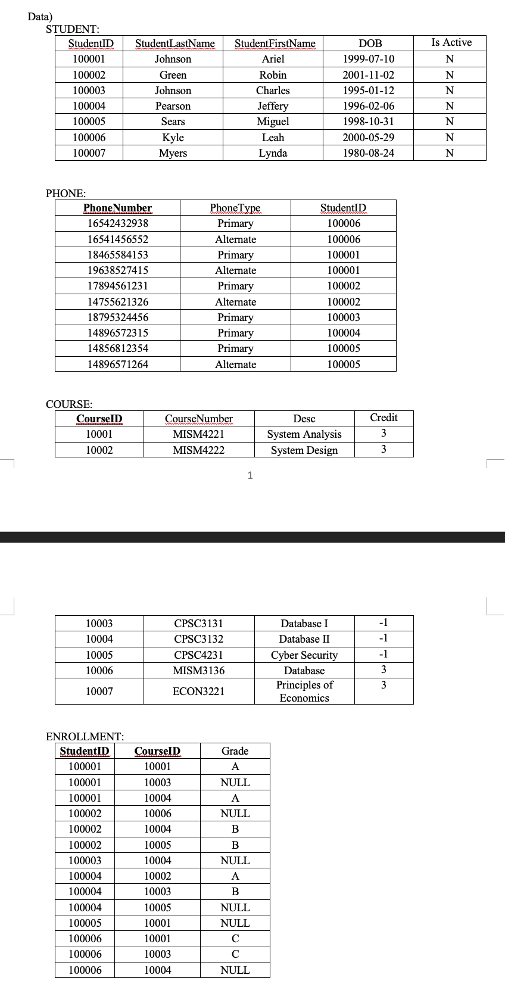

# MISM 3136 /CPSC 3131 Database Design Lab Assignment 2

### Task 1 – Insert and update data

- Open the SQLite database file with DB Browser SQLite and your .sql file that you used in Lab Assignment #3. If you want to work on a new .sql file, you may open a new tab under Execute SQL tab. Create insert statements that insert the data below to tables in the database. (SQLite does not support Date type. Use TEXT instead and use the date format YYYY-MM-DD. Then you could calculate dates in an intuitive way) – see https://www.sqlite.org/datatype3.html

- In this step, you have to create update statements that will update the data as instructed below. After creating the statements, type-in, execute, and check the update in Brows Data tab as we did in previous step (Step 1). If everything is correct, provide four screenshots of Brows Data tab for each table (as in the example). When pasting, crop the screenshot so that the statements are readable as shown in the example.

    - The student Ariel Johnson’s DOB is wrong. Update the student’s DOB to 7/10/1999’.
    - The student ‘100004’ gave his phone to student ‘100003’. Make the phone ‘14896572315’ become the alternate phone of student ‘100003’.
    - There were some mistakes on the data for Computer Science courses (Starting CPSC). Currently their credits are all -1, but they are 3 credit courses. Correct the mistakes. 
    - In the ENROLLMENT table, the meaning of NULL is the course currently taking, and the students currently taking at least one course are considered active student. According to the information in ENROLLMENT table, update the isActive field of STUDENT table to ‘Y’.

### Task 2 – Selecting data

In this task, we will select the data in various ways. According to the instruction, create and execute a select statement and provide a screenshot as in the example. This time, don’t go to Brows Data tab. After the execution of a select statement, DB Browser for SQLite will show the result in the box at the middle. Scroll your script window to show the select statement executed and take the screenshot with the result. When pasting, crop the screenshot so that the statements are readable as shown in the example.

1. Show all fields of all students’ data.
2.	Show the first name and the last name of students who are in Active status.
3.	Show the list of students (all attributes) who were born after 2000-01-01 and is currently in Active status in the alphabetical order of the last and the first name. Hint: To calculate easily, always use the date format YYYY-MM-DD
4.	Show the list of courses (all attributes) that provided by computer science department in the ascending order of course number.
5.	Show how many courses are provided by MIS department.
6.	Show the sum, average, max, min of student age. For the numbers, provided appropriate field names. Hint: to calculate age, simply use date(‘now’)-DOB
7.	Show the students’ first and last name who have gotten ‘A’ at least once by using sub query.
8.	Show students’ first name, last name, their phone(s), and phone type.
9.	Show the list of courses numbers that are taken at least once by students. The course should appear once even if the course is taken multiple times.
10.	Show students’ first name and last name, the course numbers the student took (don’t include currently taking) and its credits, and the grades of the courses in the ascending order of last name and first name and descending order of course number 
11.	Show students’ first name, last name, the grades of the students, and the credits of the course for the students who took (don’t include currently taking) the course ‘MISM4221’. 
12.	Show the students’ ID and the courses number the students took (don’t include currently taking) and other courses that is not taken by any students by using one query statement. Hint: use LEFT JOIN